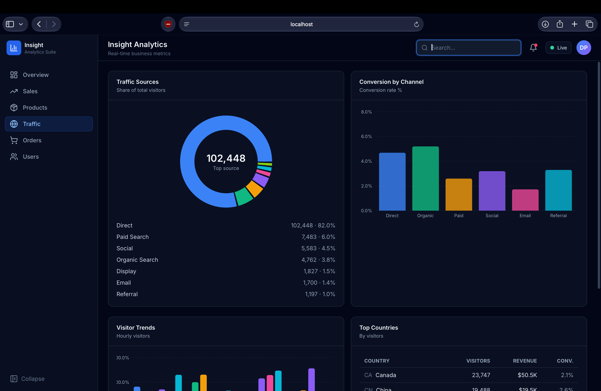
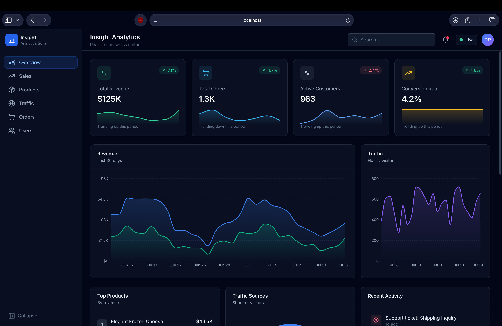
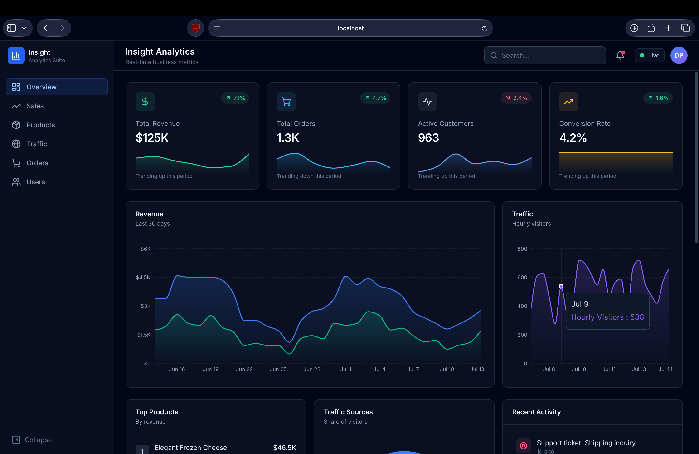
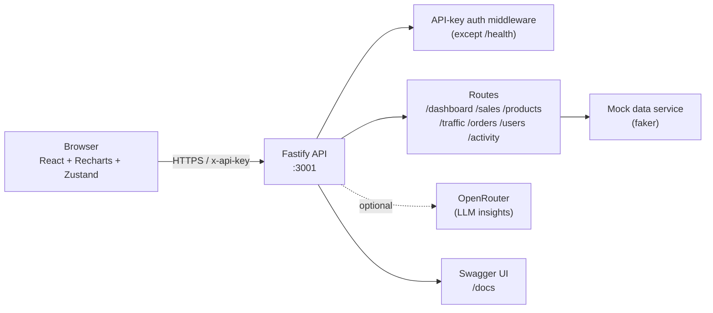

# Insight Analytics

> A full-stack analytics dashboard — Fastify API + React/SPA with dark, SaaS-style visualizations.

[](https://github.com/Diyaneshwar-Pugazhendhi/insight-analytics/actions/workflows/ci.yml)
[](LICENSE)
[](https://nodejs.org)
[](https://fastify.dev)
[](https://vitejs.dev)

## Features

- **Six analytics views** — Overview (KPIs + charts + activity), Sales (period toggle), Products, Traffic, Orders, and Users.
- **Interactive charts** — area, bar, and donut visualizations built with Recharts.
- **Sortable, paginated tables** — Orders and Users support server-side sorting and pagination.
- **API-key authentication** — every endpoint (except `/health`) is protected; the frontend authenticates transparently.
- **Dark SaaS UI** — Tailwind-based design with a collapsible sidebar and responsive layout.
- **Type-safe** — shared Zod schemas and TypeScript end to end.

## Screenshots

| Overview | Sales | Products |
| -------- | ----- | -------- |
|  |  |  |

## Architecture



## Tech stack

| Layer     | Technologies                                                        |
| --------- | ------------------------------------------------------------------- |
| Backend   | Fastify, Zod, faker (mock data), pino, CORS, Helmet, rate-limit    |
| Frontend  | React 18, Vite, TypeScript, Tailwind CSS, React Router, Zustand, axios, Recharts |
| Tooling   | npm workspaces (root + `backend` + `frontend` + `shared`)          |

## Getting started

```bash
# from the project root
npm install
npm run dev
```

- Frontend: http://localhost:5173
- Backend API: http://localhost:3001
- Swagger UI: http://localhost:3001/docs

`npm run dev` starts both servers concurrently. The frontend calls the
backend directly (CORS is enabled).

## Authentication

All API endpoints except `GET /health` require an **API key**, sent as the
`x-api-key` header or a `Bearer` token.

- **Local dev:** a default dev key is used on both sides, so the app runs with no setup.
- **Production:** set a strong key on the backend (`API_KEY`) and the matching
  `VITE_API_KEY` when building the frontend. The backend **refuses to start**
  if `API_KEY` is still the dev default in production.

The frontend sends the key automatically via the axios client
(`frontend/src/lib/api.ts`).

```bash
curl -H "x-api-key: dev-key-change-me" http://localhost:3001/dashboard
```

## Environment variables

**Backend** (`backend/src/env.ts`):

| Variable             | Default                  | Purpose                                |
| -------------------- | ------------------------ | -------------------------------------- |
| `PORT`               | `3001`                   | API port                               |
| `NODE_ENV`           | `development`            | `production` enforces a real `API_KEY` |
| `API_KEY`            | `dev-key-change-me`      | Required to access the API             |
| `OPENROUTER_API_KEY` | _(empty)_                | Optional; enables the OpenRouter feature |
| `OPENROUTER_MODEL`   | `openrouter/free`        | Model used for OpenRouter calls        |
| `CORS_ORIGIN`        | `http://localhost:5173`  | Allowed frontend origin                |
| `RATE_LIMIT_MAX`     | `100`                    | Requests per window                    |

**Frontend** (`frontend/.env`, gitignored):

| Variable        | Default                  | Purpose                     |
| --------------- | ------------------------ | --------------------------- |
| `VITE_API_URL`  | `http://localhost:3001`  | Backend base URL            |
| `VITE_API_KEY`  | `dev-key-change-me`      | API key sent to the backend |

## API endpoints

`GET /dashboard` · `GET /metrics` · `GET /sales?period=7d|30d|90d|1y` ·
`GET /products` · `GET /traffic` · `GET /activity?limit=` ·
`GET /orders` · `GET /users` (orders/users support `page`, `pageSize`,
`sortField`, `sortDirection`, `search`, `filters`) · `GET /health`.

## Project structure

```
insight-analytics/
├── backend/      # Fastify API + mock data + auth middleware
├── frontend/     # React SPA (pages, components, charts, api client)
├── shared/       # Shared TypeScript types
├── docs/         # Screenshots
└── package.json  # npm workspaces + dev/build scripts
```

## License

[MIT](LICENSE) © 2026 Diyaneshwar Pugazhendhi.
